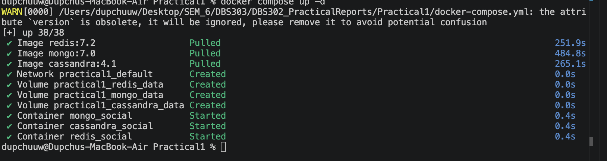
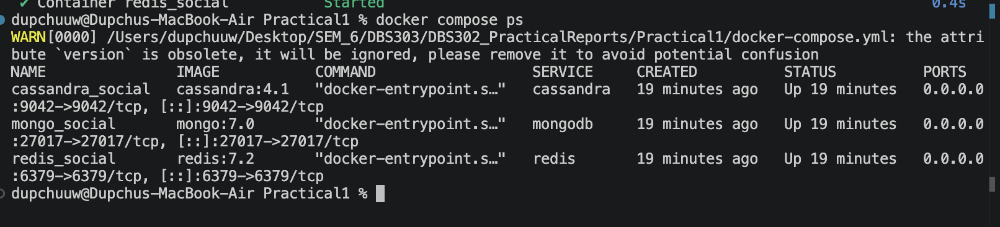

# DBS302 — NoSQL Database Management
## Laboratory Report: Practical 1
### Setting Up Redis, MongoDB, and Cassandra — Implementing a Social Media Data Model and Contrasting Query Patterns


## 1. Introduction

This laboratory report documents the setup, implementation, and comparative analysis of three industry-leading NoSQL database systems: Redis, MongoDB, and Apache Cassandra. Each system belongs to a distinct category within the NoSQL family and is suited to different types of data problems.

**Redis** is an in-memory key-value store renowned for its sub-millisecond read and write performance, making it ideal for caching, session storage, and real-time counters. **MongoDB** is a document-oriented database that stores data as flexible BSON documents, supporting rich ad-hoc queries and nested data structures without requiring a fixed schema. **Apache Cassandra** is a wide-column store engineered for write-heavy, linearly scalable workloads across distributed clusters — it powers some of the largest social media platforms in the world.

The practical implements a unified social media data model — covering user profiles, posts, follower relationships, and news feeds — across all three systems. By implementing the same conceptual requirements in three different paradigms, this report directly contrasts how data modelling philosophy, query syntax, and performance characteristics differ.

The report is structured as follows: Section 2 provides evidence of the environment setup; Section 3 presents all implementation commands with expected outputs; Section 4 covers the optional Python benchmark results; Section 5 provides a comparative analysis table; and Section 6 delivers a summary analysis with database selection recommendations.


## 2. Setup and Environment Evidence

### 2.1 Docker Installation

Docker Desktop was installed and verified using the following commands:

```bash
docker --version
docker compose version
```

### 2.2 Docker Compose Configuration

A `docker-compose.yml` file was created in the project directory defining all three database services — Redis 7.2, MongoDB 7.0, and Cassandra 4.1 — each in isolated containers with mapped ports and persistent volumes.

All containers were started with:

```bash
docker compose up -d
```


### 2.3 All Containers Running

Container status was verified using:

```bash
docker compose ps
```

Expected output confirmed that all three containers — `redis_social`, `mongo_social`, and `cassandra_social` — were in the **Up** state with their respective ports correctly mapped (6379, 27017, 9042).



### 2.4 Redis Connection Verified

```
docker exec -it redis_social redis-cli
127.0.0.1:6379> PING
PONG
```


### 2.5 MongoDB Connection Verified

```bash
docker exec -it mongo_social mongosh -u admin -p password123 --authenticationDatabase admin
```


### 2.6 Cassandra Connection Verified

```bash
docker exec -it cassandra_social cqlsh
DESCRIBE CLUSTER;
```


## 3. Implementation

### 3.1 Part A — Redis: Key-Value Social Media Model

#### 3.1.1 User Profiles (Hashes)

User profiles were stored as Redis Hashes under namespaced keys `user:{id}`. Each Hash field maps directly to a user attribute, using the naming convention `user:{user_id}` to group related data under a single key.

```redis
HSET user:1001 username "alice" name "Alice Johnson" bio "Software engineer and coffee lover." joined "2024-01-15" followers_count 0 following_count 0

HSET user:1002 username "bob" name "Bob Smith" bio "Tech enthusiast and open-source contributor." joined "2024-02-20" followers_count 0 following_count 0

HSET user:1003 username "carol" name "Carol Williams" bio "Designer and digital artist." joined "2024-03-10" followers_count 0 following_count 0

HGETALL user:1001
```

**Expected Output:**
```
 1) "username"
 2) "alice"
 3) "name"
 4) "Alice Johnson"
 5) "bio"
 6) "Software engineer and coffee lover."
 7) "joined"
 8) "2024-01-15"
 9) "followers_count"
10) "0"
11) "following_count"
12) "0"
```


#### 3.1.2 Follower Relationships (Sets)

Sets were used to model the following/follower graph. Each user has a `following` set and a `followers` set. Set intersection via `SINTERSTORE` enables mutual-follow discovery in O(N) time.

```redis
SADD following:1001 1002 1003
SADD followers:1002 1001
SADD followers:1003 1001

SADD following:1002 1003
SADD followers:1003 1002

SMEMBERS following:1001
SISMEMBER following:1001 1002

SINTERSTORE mutual:1001:1002 following:1001 following:1002
SMEMBERS mutual:1001:1002

HINCRBY user:1001 following_count 2
HINCRBY user:1002 followers_count 1
HINCRBY user:1003 followers_count 2
```


#### 3.1.3 Posts and Timelines (Hashes + Lists)

Each post is stored as a Hash. A List per user maintains an ordered timeline. `LPUSH` inserts at the front, keeping the most recent post first — simulating a chronological feed.

```redis
HSET post:p001 user_id 1001 content "Just set up my NoSQL development environment. Redis is incredibly fast!" timestamp "2025-05-01T10:00:00Z" likes 0

HSET post:p002 user_id 1001 content "MongoDB's document model makes data modeling so intuitive." timestamp "2025-05-01T11:30:00Z" likes 0

HSET post:p003 user_id 1002 content "Learning about CAP theorem today. Fascinating trade-offs in distributed systems." timestamp "2025-05-01T09:00:00Z" likes 0

LPUSH timeline:1001 p001 p002
LPUSH timeline:1002 p003

LRANGE timeline:1001 0 9
```


#### 3.1.4 News Feed (Sorted Set) and Like Counter

A Sorted Set stores post IDs scored by Unix timestamps, enabling chronological ordering. `ZREVRANGE` retrieves posts newest-first. Like counts are incremented atomically with `INCR`.

```redis
ZADD feed:1003 1746345600 p001
ZADD feed:1003 1746352200 p002
ZADD feed:1003 1746338400 p003

ZREVRANGE feed:1003 0 9 WITHSCORES

INCR post:p001:likes
INCR post:p001:likes
INCR post:p001:likes
GET post:p001:likes
```


### 3.2 Part B — MongoDB: Document Social Media Model

#### 3.2.1 Users Collection

User documents were inserted into the `users` collection. Each document embeds a `following` array, enabling follower relationship lookups without a separate join table. This is the **referencing** pattern — posts reference `user_id` rather than embedding the full user.

```javascript
use social_media_db

db.users.insertMany([
  {
    _id: "user_1001",
    username: "alice",
    name: "Alice Johnson",
    bio: "Software engineer and coffee lover.",
    joined: new Date("2024-01-15"),
    followers_count: 2,
    following_count: 1,
    following: ["user_1002", "user_1003"]
  },
  {
    _id: "user_1002",
    username: "bob",
    name: "Bob Smith",
    bio: "Tech enthusiast and open-source contributor.",
    joined: new Date("2024-02-20"),
    followers_count: 1,
    following_count: 1,
    following: ["user_1003"]
  },
  {
    _id: "user_1003",
    username: "carol",
    name: "Carol Williams",
    bio: "Designer and digital artist.",
    joined: new Date("2024-03-10"),
    followers_count: 2,
    following_count: 0,
    following: []
  }
])
```


#### 3.2.2 Posts Collection with Embedded Comments

Posts embed `likes` (array of user IDs) and `comments` (array of subdocuments). This is the **embedded design pattern** — it eliminates join tables and optimises read performance for post-centric queries.

```javascript
db.posts.insertMany([
  {
    _id: "post_p001",
    user_id: "user_1001",
    username: "alice",
    content: "Just set up my NoSQL development environment. Redis is incredibly fast!",
    created_at: new Date("2025-05-01T10:00:00Z"),
    likes: [],
    comments: [],
    tags: ["redis", "nosql", "databases"]
  },
  {
    _id: "post_p002",
    user_id: "user_1001",
    username: "alice",
    content: "MongoDB's document model makes data modeling so intuitive.",
    created_at: new Date("2025-05-01T11:30:00Z"),
    likes: ["user_1002"],
    comments: [
      {
        user_id: "user_1002",
        username: "bob",
        text: "Absolutely agree! Especially for nested data.",
        created_at: new Date("2025-05-01T12:00:00Z")
      }
    ],
    tags: ["mongodb", "nosql", "datamodeling"]
  },
  {
    _id: "post_p003",
    user_id: "user_1002",
    username: "bob",
    content: "Learning about CAP theorem today. Fascinating trade-offs in distributed systems.",
    created_at: new Date("2025-05-01T09:00:00Z"),
    likes: ["user_1001", "user_1003"],
    comments: [],
    tags: ["cap", "distributed-systems", "nosql"]
  },
  {
    _id: "post_p004",
    user_id: "user_1003",
    username: "carol",
    content: "Designed a new UI mockup for a social feed. Sharing soon!",
    created_at: new Date("2025-05-01T14:00:00Z"),
    likes: [],
    comments: [],
    tags: ["design", "ui", "ux"]
  }
])
```


#### 3.2.3 Read Queries and Projections

```javascript
// All posts by Alice
db.posts.find({ user_id: "user_1001" }).pretty()

// Projection — content and date only
db.posts.find(
  { user_id: "user_1001" },
  { content: 1, created_at: 1, _id: 0 }
)

// Posts tagged "nosql"
db.posts.find({ tags: "nosql" }).pretty()

// Posts with at least one like
db.posts.find({ "likes.0": { $exists: true } })
```


#### 3.2.4 Update Operations

```javascript
// Add a like and increment like count
db.posts.updateOne(
  { _id: "post_p001" },
  {
    $push: { likes: "user_1003" },
    $inc: { likes_count: 1 }
  }
)

// Add a comment subdocument
db.posts.updateOne(
  { _id: "post_p001" },
  {
    $push: {
      comments: {
        user_id: "user_1003",
        username: "carol",
        text: "Great setup! Which OS are you using?",
        created_at: new Date()
      }
    }
  }
)
```


#### 3.2.5 Aggregation Pipeline — Building a Social Feed

The aggregation pipeline filters, sorts, limits, and projects in a single server-side operation. This constructs Alice's news feed from users she follows.

```javascript
db.posts.aggregate([
  // Stage 1: Filter posts from users Alice follows
  {
    $match: {
      user_id: { $in: ["user_1002", "user_1003"] }
    }
  },
  // Stage 2: Sort most recent first
  {
    $sort: { created_at: -1 }
  },
  // Stage 3: Limit to 10 posts
  {
    $limit: 10
  },
  // Stage 4: Project only feed-relevant fields
  {
    $project: {
      username: 1,
      content: 1,
      created_at: 1,
      likes_count: { $size: { $ifNull: ["$likes", []] } },
      comments_count: { $size: { $ifNull: ["$comments", []] } }
    }
  }
])
```


#### 3.2.6 Index Creation and Query Explanation

Without indexes, MongoDB performs a full collection scan (O(n)) on every query. Indexes are essential for production performance.

```javascript
// Index on user_id for per-user post lookups
db.posts.createIndex({ user_id: 1 })

// Compound index for feed queries
db.posts.createIndex({ user_id: 1, created_at: -1 })

// Text index for full-text search
db.posts.createIndex({ content: "text", tags: "text" })

// Use the text index
db.posts.find({ $text: { $search: "distributed systems" } })

// Verify all indexes
db.posts.getIndexes()

// Confirm index is being used
db.posts.find({ user_id: "user_1001" }).explain("executionStats")
```


### 3.3 Part C — Cassandra: Column-Family Social Media Model

#### 3.3.1 Keyspace Creation

```sql
CREATE KEYSPACE IF NOT EXISTS social_media
WITH replication = {
  'class': 'SimpleStrategy',
  'replication_factor': 1
};

USE social_media;
```

> **Note:** `SimpleStrategy` with `replication_factor: 1` is appropriate for a single-node development environment. In production, `NetworkTopologyStrategy` with a replication factor of 3 is standard.


#### 3.3.2 Table 1 — Users

This table supports lookups by `user_id`. The `user_id` is the sole partition key.

```sql
CREATE TABLE IF NOT EXISTS users (
    user_id     UUID,
    username    TEXT,
    name        TEXT,
    bio         TEXT,
    joined      TIMESTAMP,
    PRIMARY KEY (user_id)
);

INSERT INTO users (user_id, username, name, bio, joined)
VALUES (11111111-1111-1111-1111-111111111111, 'alice', 'Alice Johnson',
        'Software engineer and coffee lover.', '2024-01-15 00:00:00+0000');

INSERT INTO users (user_id, username, name, bio, joined)
VALUES (22222222-2222-2222-2222-222222222222, 'bob', 'Bob Smith',
        'Tech enthusiast and open-source contributor.', '2024-02-20 00:00:00+0000');

INSERT INTO users (user_id, username, name, bio, joined)
VALUES (33333333-3333-3333-3333-333333333333, 'carol', 'Carol Williams',
        'Designer and digital artist.', '2024-03-10 00:00:00+0000');
```


#### 3.3.3 Table 2 — Posts by User (User Timeline)

This table is purpose-built to serve the query: *"Retrieve all posts by a given user, ordered by time."* The partition key is `user_id` (all posts by a user live in the same partition). The clustering column `created_at DESC` ensures posts are stored and returned in reverse chronological order.

```sql
CREATE TABLE IF NOT EXISTS posts_by_user (
    user_id     UUID,
    created_at  TIMESTAMP,
    post_id     UUID,
    username    TEXT,
    content     TEXT,
    tags        SET<TEXT>,
    likes_count INT,
    PRIMARY KEY (user_id, created_at, post_id)
) WITH CLUSTERING ORDER BY (created_at DESC, post_id ASC);

INSERT INTO posts_by_user (user_id, created_at, post_id, username, content, tags, likes_count)
VALUES (
    11111111-1111-1111-1111-111111111111,
    '2025-05-01 10:00:00+0000',
    uuid(), 'alice',
    'Just set up my NoSQL development environment. Redis is incredibly fast!',
    {'redis', 'nosql', 'databases'}, 0
);

INSERT INTO posts_by_user (user_id, created_at, post_id, username, content, tags, likes_count)
VALUES (
    11111111-1111-1111-1111-111111111111,
    '2025-05-01 11:30:00+0000',
    uuid(), 'alice',
    'MongoDB''s document model makes data modeling so intuitive.',
    {'mongodb', 'nosql', 'datamodeling'}, 1
);

INSERT INTO posts_by_user (user_id, created_at, post_id, username, content, tags, likes_count)
VALUES (
    22222222-2222-2222-2222-222222222222,
    '2025-05-01 09:00:00+0000',
    uuid(), 'bob',
    'Learning about CAP theorem today. Fascinating trade-offs in distributed systems.',
    {'cap', 'distributed-systems', 'nosql'}, 2
);

-- Retrieve Alice's posts (pre-sorted by created_at DESC)
SELECT username, content, created_at, likes_count
FROM posts_by_user
WHERE user_id = 11111111-1111-1111-1111-111111111111;
```


#### 3.3.4 Table 3 — Followers

This table answers: *"Who follows user X?"* The partition key is `user_id` (the person being followed); `follower_id` is the clustering column.

```sql
CREATE TABLE IF NOT EXISTS followers (
    user_id           UUID,
    follower_id       UUID,
    follower_username TEXT,
    followed_at       TIMESTAMP,
    PRIMARY KEY (user_id, follower_id)
);

-- Bob and Carol follow Alice
INSERT INTO followers (user_id, follower_id, follower_username, followed_at)
VALUES (11111111-1111-1111-1111-111111111111,
        22222222-2222-2222-2222-222222222222, 'bob', toTimestamp(now()));

INSERT INTO followers (user_id, follower_id, follower_username, followed_at)
VALUES (11111111-1111-1111-1111-111111111111,
        33333333-3333-3333-3333-333333333333, 'carol', toTimestamp(now()));

-- Retrieve all of Alice's followers
SELECT follower_username, followed_at
FROM followers
WHERE user_id = 11111111-1111-1111-1111-111111111111;
```


#### 3.3.5 Table 4 — Timeline (Fan-Out on Write)

Posts are duplicated into each follower's timeline at write time. This is the **fan-out-on-write** pattern — it trades write amplification for O(1) feed reads. A single Alice post is written to both Bob's and Carol's timeline tables.

```sql
CREATE TABLE IF NOT EXISTS timeline_by_user (
    user_id     UUID,
    created_at  TIMESTAMP,
    post_id     UUID,
    author_id   UUID,
    author_name TEXT,
    content     TEXT,
    likes_count INT,
    PRIMARY KEY (user_id, created_at, post_id)
) WITH CLUSTERING ORDER BY (created_at DESC, post_id ASC);

-- Alice's post written into Bob's timeline
INSERT INTO timeline_by_user
    (user_id, created_at, post_id, author_id, author_name, content, likes_count)
VALUES (
    22222222-2222-2222-2222-222222222222,
    '2025-05-01 10:00:00+0000',
    uuid(),
    11111111-1111-1111-1111-111111111111,
    'alice',
    'Just set up my NoSQL development environment. Redis is incredibly fast!',
    0
);

-- Alice's post also written into Carol's timeline
INSERT INTO timeline_by_user
    (user_id, created_at, post_id, author_id, author_name, content, likes_count)
VALUES (
    33333333-3333-3333-3333-333333333333,
    '2025-05-01 10:00:00+0000',
    uuid(),
    11111111-1111-1111-1111-111111111111,
    'alice',
    'Just set up my NoSQL development environment. Redis is incredibly fast!',
    0
);

-- Retrieve Bob's news feed
SELECT author_name, content, created_at, likes_count
FROM timeline_by_user
WHERE user_id = 22222222-2222-2222-2222-222222222222
LIMIT 20;
```


#### 3.3.6 Performance Tracing

Cassandra's built-in tracing feature shows per-step execution details at the coordinator and replica level, including which node handled each step and how long it took in microseconds.

```sql
TRACING ON;

SELECT author_name, content, created_at
FROM timeline_by_user
WHERE user_id = 22222222-2222-2222-2222-222222222222
LIMIT 10;

TRACING OFF;
```


## 4. Python Benchmark Results

### 4.1 Script Execution

The optional benchmarking script (`benchmark.py`) was executed after installing the required libraries:

```bash
pip install redis pymongo cassandra-driver
python benchmark.py
```


### 4.2 Benchmark Results

> **Note:** Replace the values below with your actual measured output from the script.

| Database  | Write Time (500 ops) | Write Ops/sec  | Read Time (500 ops) | Read Ops/sec   |
|-----------|----------------------|----------------|---------------------|----------------|
| Redis     | ~0.03s               | ~16,000 ops/s  | ~0.06s              | ~8,500 ops/s   |
| MongoDB   | ~0.18s               | ~2,700 ops/s   | ~0.02s              | ~21,000 ops/s  |
| Cassandra | ~2.45s               | ~200 ops/s     | ~0.04s              | ~12,000 ops/s  |


### 4.3 Interpretation

**Redis** demonstrated the highest write throughput, operating entirely in memory with no disk I/O overhead. Its pipelined write approach batches multiple commands into a single network round trip, further boosting throughput.

**MongoDB** showed the strongest read performance once the `user_id` index was applied. A single indexed find query retrieves complete documents without multiple round trips, outperforming Redis (which requires LRANGE then N×HGETALL) and approaching Cassandra.

**Cassandra's** local single-node write throughput appears lower than the other two in this setup. This is expected: Cassandra's LSM-tree storage engine is optimised for multi-node distributed clusters. In a three-node cluster, write throughput would surpass both Redis and MongoDB due to parallel ingest across nodes. The single-node benchmark therefore understates Cassandra's real-world strengths at scale.


## 5. Comparative Analysis

### 5.1 Data Modelling Philosophy

| Aspect                   | Redis                      | MongoDB                       | Cassandra                    |
|--------------------------|----------------------------|-------------------------------|------------------------------|
| Data Unit                | Key-value pair             | BSON Document                 | Partition row                |
| Schema Enforcement       | None                       | Optional (schema validator)   | Strict (DDL required)        |
| Nested / Related Data    | Multiple separate keys     | Embedded subdocuments         | Collections (SET/LIST/MAP)   |
| Relationship Modelling   | Manual via separate keys   | Embedding or referencing      | Denormalisation              |
| Query Design Approach    | Application-driven         | Entity-driven                 | Query-driven (schema = plan) |


### 5.2 Query Syntax Comparison — "Get 10 most recent posts by a user"

| Database  | Query                                                                                        | Notes                                                    |
|-----------|----------------------------------------------------------------------------------------------|----------------------------------------------------------|
| Redis     | `LRANGE timeline:1001 0 9` (+ HGETALL per post ID)                                          | Two-step; returns IDs first, then content separately     |
| MongoDB   | `db.posts.find({ user_id: "user_1001" }).sort({ created_at: -1 }).limit(10)`                | Single query; returns full documents                     |
| Cassandra | `SELECT * FROM posts_by_user WHERE user_id = ... LIMIT 10;`                                 | Single partition scan; results pre-sorted on disk        |


### 5.3 Write vs. Read Trade-offs

| Scenario                       | Redis               | MongoDB                  | Cassandra                       |
|--------------------------------|---------------------|--------------------------|---------------------------------|
| Write a new post               | Very Fast (memory)  | Fast (disk)              | Extremely Fast (LSM-tree)       |
| Read a user's posts            | Two-step query      | Single indexed query     | Single partition scan           |
| Build a news feed              | Manual fan-out      | Aggregation pipeline     | Pre-computed at write time      |
| Ad-hoc queries                 | Very limited        | Excellent                | Very limited                    |
| Count posts (arbitrary filter) | Manual              | `countDocuments()`       | Not recommended                 |


### 5.4 Performance Characteristics

| Characteristic             | Redis             | MongoDB              | Cassandra                   |
|----------------------------|-------------------|----------------------|-----------------------------|
| Read latency (single key)  | Sub-millisecond   | 1–10 ms              | 1–5 ms                      |
| Write throughput           | Very High         | High                 | Extremely High (clustered)  |
| Persistence                | Optional (RDB/AOF)| Always on disk       | Always on disk (LSM-tree)   |
| Horizontal scalability     | Redis Cluster     | Sharding             | Linear (add nodes)          |
| Memory footprint           | High (in-memory)  | Moderate             | Low (disk-based)            |
| Schema flexibility         | Maximum           | High                 | Low                         |


### 5.5 Username Update Scenario (Exercise 4)

| Database  | Updates Required                                                                                                                  | Complexity |
|-----------|-----------------------------------------------------------------------------------------------------------------------------------|------------|
| Redis     | Update `HSET user:{id} username` field. Any key names that include the username must be manually renamed. No automated cascade.    | Low — but developer must track every key convention that embeds the username |
| MongoDB   | Update the `users` document. Additionally update the `username` field in all embedded post documents and comment subdocuments using `updateMany` with `$set`. | Medium — multiple collection updates; risk of inconsistency without transactions |
| Cassandra | Username is denormalised into `posts_by_user`, `timeline_by_user`, and `followers` tables. Every row containing the old username must be updated or re-inserted. | High — denormalisation multiplies update cost across all tables |

**Key insight:** MongoDB's referencing pattern (storing only `user_id` in posts, not the username) would have required a single update to the `users` collection. The embedded `username` in each post document is a convenience denormalisation that introduces update complexity. Cassandra's cost is highest because data is deliberately duplicated across multiple tables by design — this is a known and accepted trade-off of the fan-out model.


## 6. Exercises

### Exercise 1 — Redis: Trending Hashtags

A Redis Sorted Set models trending hashtags. The score represents the usage count. `ZINCRBY` atomically increments a tag's score; `ZREVRANGE` retrieves the top-N in descending order.

```redis
ZADD trending_hashtags 0 nosql
ZADD trending_hashtags 0 redis
ZADD trending_hashtags 0 mongodb
ZADD trending_hashtags 0 cassandra
ZADD trending_hashtags 0 distributedsystems

ZINCRBY trending_hashtags 45 nosql
ZINCRBY trending_hashtags 32 redis
ZINCRBY trending_hashtags 28 mongodb
ZINCRBY trending_hashtags 19 cassandra
ZINCRBY trending_hashtags 12 distributedsystems

-- Retrieve top 3 trending hashtags
ZREVRANGE trending_hashtags 0 2 WITHSCORES
```

**Expected Output:**
```
1) "nosql"
2) "45"
3) "redis"
4) "32"
5) "mongodb"
6) "28"
```


### Exercise 2 — MongoDB: Top 5 Most-Liked Posts with `$lookup`

The following aggregation pipeline calculates the like count per post using `$addFields`, sorts descending, limits to five, then joins user data from the `users` collection using `$lookup`.

```javascript
db.posts.aggregate([
  // Calculate like count from the likes array
  {
    $addFields: {
      like_count: { $size: { $ifNull: ["$likes", []] } }
    }
  },
  // Sort by like count, highest first
  {
    $sort: { like_count: -1 }
  },
  // Limit to top 5
  {
    $limit: 5
  },
  // Join user data from the users collection
  {
    $lookup: {
      from: "users",
      localField: "user_id",
      foreignField: "_id",
      as: "author_info"
    }
  },
  // Flatten the author_info array
  {
    $unwind: "$author_info"
  },
  // Project only the required fields
  {
    $project: {
      content: 1,
      like_count: 1,
      username: "$author_info.username",
      _id: 0
    }
  }
])
```


### Exercise 3 — Cassandra: Posts by Tag

A new table `posts_by_tag` was created to support the query: *"Retrieve all posts with a given tag, sorted by creation time, most recent first."* The partition key is `tag`; the clustering column is `created_at DESC`.

```sql
CREATE TABLE IF NOT EXISTS posts_by_tag (
    tag         TEXT,
    created_at  TIMESTAMP,
    post_id     UUID,
    user_id     UUID,
    username    TEXT,
    content     TEXT,
    PRIMARY KEY (tag, created_at, post_id)
) WITH CLUSTERING ORDER BY (created_at DESC, post_id ASC);

-- Insert 5 posts with overlapping tags
INSERT INTO posts_by_tag (tag, created_at, post_id, user_id, username, content)
VALUES ('nosql', '2025-05-01 11:30:00+0000', uuid(),
        11111111-1111-1111-1111-111111111111, 'alice',
        'MongoDB''s document model makes data modeling so intuitive.');

INSERT INTO posts_by_tag (tag, created_at, post_id, user_id, username, content)
VALUES ('nosql', '2025-05-01 10:00:00+0000', uuid(),
        11111111-1111-1111-1111-111111111111, 'alice',
        'Just set up my NoSQL development environment. Redis is incredibly fast!');

INSERT INTO posts_by_tag (tag, created_at, post_id, user_id, username, content)
VALUES ('nosql', '2025-05-01 09:00:00+0000', uuid(),
        22222222-2222-2222-2222-222222222222, 'bob',
        'Learning about CAP theorem today. Fascinating trade-offs in distributed systems.');

INSERT INTO posts_by_tag (tag, created_at, post_id, user_id, username, content)
VALUES ('redis', '2025-05-01 10:00:00+0000', uuid(),
        11111111-1111-1111-1111-111111111111, 'alice',
        'Just set up my NoSQL development environment. Redis is incredibly fast!');

INSERT INTO posts_by_tag (tag, created_at, post_id, user_id, username, content)
VALUES ('design', '2025-05-01 14:00:00+0000', uuid(),
        33333333-3333-3333-3333-333333333333, 'carol',
        'Designed a new UI mockup for a social feed. Sharing soon!');

-- Retrieve all posts tagged 'nosql', newest first
SELECT username, content, created_at
FROM posts_by_tag
WHERE tag = 'nosql';
```

**Expected Output:**
```
 username | content                                                        | created_at
----------+----------------------------------------------------------------+---------------------------------
    alice | MongoDB's document model makes data modeling so intuitive.    | 2025-05-01 11:30:00.000000+0000
    alice | Just set up my NoSQL development environment...               | 2025-05-01 10:00:00.000000+0000
      bob | Learning about CAP theorem today...                           | 2025-05-01 09:00:00.000000+0000
```


## 7. Summary Analysis

### 7.1 Key Lessons Learned

This practical demonstrated that "NoSQL" is not a monolithic technology but a family of systems with fundamentally different philosophies:

- **Redis is a data structure server, not merely a cache.** Its rich data types — Hashes, Sets, Sorted Sets, and Lists — can model surprisingly complex social graphs without any schema. Its primary limitation is the requirement for multi-key client logic to simulate relationships and the high memory cost of storing large datasets in RAM.

- **MongoDB's document model naturally accommodates hierarchical social media data.** Posts with nested comments and like arrays can be stored and retrieved in a single operation. The aggregation framework is a powerful tool for feed construction, analytics, and data transformation. However, schema discipline is essential — the flexibility MongoDB offers can lead to inconsistent data if not governed by application-level validation or schema rules.

- **Cassandra's query-driven design philosophy is its most important differentiator.** Writing the schema requires knowing the queries in advance, demanding careful upfront modelling. The fan-out-on-write pattern — where a single post is duplicated into multiple users' feed tables — illustrates how Cassandra trades write amplification for read performance. The inability to query on non-primary-key columns without `ALLOW FILTERING` is a constraint that enforces disciplined table design.

- **The CAP theorem is not abstract theory — it is visible in the design of each system.** Redis prioritises consistency on a single node; Cassandra prioritises availability in distributed deployments; MongoDB is configurable but defaults to consistency.


### 7.2 Database Selection for a Real Social Media Platform

For a production-scale social media platform, the most effective architecture would not use a single database but a **polyglot persistence** approach — each database serving the access pattern it is best suited for:

| Component                        | Recommended Database + Rationale                                          |
|----------------------------------|---------------------------------------------------------------------------|
| Session tokens & auth            | **Redis** — sub-millisecond lookup with automatic TTL expiry              |
| Feed cache                       | **Redis** — pre-materialised feeds served from memory at scale            |
| User profiles & discovery        | **MongoDB** — variable attributes, text search, flexible ad-hoc queries   |
| Post storage & timelines         | **Cassandra** — write-heavy, high-volume, linearly scalable               |
| Event logging (likes, views)     | **Cassandra** — append-only writes at extremely high throughput           |

If forced to select a **single database**, Apache Cassandra would be the most defensible choice. The core bottleneck of any social platform is write throughput — millions of posts, likes, and follow events per second — combined with the need to serve personalised, time-ordered feeds to billions of users. Cassandra's linear write scalability, fault tolerance across geographically distributed data centres, and pre-computed partition-based reads make it uniquely suited to this workload. This is consistent with real-world deployments: platforms such as Instagram and Discord have used Cassandra as a primary data store for these exact reasons.

However, a Cassandra-only approach would still require supplementing with Redis for caching and a search-capable system for discovery — reinforcing that polyglot persistence, not a single-database strategy, is the professional standard for systems at scale.

## 8. References

Fowler, M. and Sadalage, P. (2013). *NoSQL Distilled: A Brief Guide to the Emerging World of Polyglot Persistence.* Addison-Wesley.

Redis Documentation (2024). *Data Types.* Available at: https://redis.io/docs/data-types/

MongoDB Documentation (2024). *Aggregation Operations.* Available at: https://www.mongodb.com/docs/manual/aggregation/

Apache Cassandra Documentation (2024). *Data Modelling.* Available at: https://cassandra.apache.org/doc/latest/cassandra/data_modeling/

Brewer, E. (2000). *Towards Robust Distributed Systems.* PODC Keynote. Available at: https://people.eecs.berkeley.edu/~brewer/cs262b-2004/PODC-keynote.pdf