# DBS302 – Database Systems
## Practical 3 Report

#### Name: Dupchu Wangmo

#### Std No: 02230282

## 1. Aim 
The main aim for this practical is to design and implemnt an e-commerce platform schema using MongDB, write advance quries with aggregation framework, and apply indexing and query analysis techniques to optimize performance for real-world workload. 

## 2. Objectives

The main objectives for this practical are:

- Model a realistic e-commerce domain (users, products, orders, categories) using MongoDB's document-oriented data model.
- Implement the designed schema as MongoDB collections with appropriate fields and sample data.
- Construct aggregation pipelines for analytics use cases such as daily sales, top products, and customer statistics.
- Create and tune indexes (single-field, compound, multikey, text) to support common query patterns.
- Use `explain()` and profiling techniques to identify slow queries and verify the impact of optimizations.

## 3. Theory Overview

### 3.1 MongoDB Data Modeling for E-Commerce

MongoDB uses a flexible, document-oriented schema where data that is accessed together is ideally stored together. The key design principle is **query-driven design** — the schema is shaped by the most frequent and performance-critical queries, not by normalization rules.

The two main modeling strategies are:

- **Embedding:** Store related data inside a single document. Best when data is always read together and is bounded in size (e.g., order items inside an order).
- **Referencing:** Store a reference (ObjectId) to a document in another collection. Best for many-to-many relationships or data shared across many documents (e.g., products referenced from orders).

### 3.2 Aggregation Framework

The MongoDB aggregation pipeline processes documents through a sequence of stages. The output of each stage becomes the input of the next.

| Stage | Purpose |
|-------|---------|
| `$match` | Filters documents (like WHERE in SQL) |
| `$group` | Groups documents and computes aggregate values (SUM, AVG, COUNT) |
| `$project` | Reshapes documents, includes/excludes fields |
| `$sort` | Orders documents by one or more fields |
| `$lookup` | Performs a left outer join with another collection |
| `$unwind` | Deconstructs an array field into separate documents |
| `$limit` | Restricts output to a specified number of documents |

### 3.3 Indexing and Query Optimization

Indexes are data structures that speed up query execution by avoiding full collection scans (`COLLSCAN`). Without indexes, MongoDB must examine every document in a collection for each query.

Key index types used in this practical:

- **Single-field index:** Indexes one field.
- **Compound index:** Indexes multiple fields. The ESR rule (Equality → Sort → Range) guides optimal field ordering.
- **Text index:** Enables full-text search across string fields with relevance scoring.
- **Multikey index:** Automatically created when indexing array fields.

Query plans are analyzed using `explain("executionStats")`, which shows whether a query uses `IXSCAN` (index scan) or `COLLSCAN` (slow full scan), and reports `totalDocsExamined` and `executionTimeMillis`.

## 4. Schema Design

### 4.1 Collections Overview

| Collection | Description |
|------------|-------------|
| `users` | Customer accounts with address details |
| `categories` | Product categories with optional parent-child hierarchy |
| `products` | Product catalog using the Attribute Pattern for variable specs |
| `orders` | Customer orders with embedded order items for read efficiency |

### 4.2 Embedding vs. Referencing Decisions

| Relationship | Strategy | Reason |
|--------------|----------|--------|
| Order → Order Items | Embedded | Items are always read with the order; array is bounded |
| Order → User | Referenced (`userId`) | Users exist independently; one-to-many |
| Order → Product | Referenced (`productId`) | Products are shared across many orders |
| Product → Category | Referenced (`categoryId`) | Categories are reused across many products |

### 4.3 users Collection – Sample Document

```json
{
  "_id": ObjectId("..."),
  "name": "Tashi Dorji",
  "email": "tashi@example.com",
  "phone": "+975-17-123-456",
  "address": {
    "line1": "Building 12",
    "city": "Thimphu",
    "country": "Bhutan",
    "postalCode": "11001"
  },
  "createdAt": ISODate("2026-04-18T08:00:00Z")
}
```

### 4.4 products Collection – Attribute Pattern

The **Attribute Pattern** is used to handle heterogeneous product attributes across different categories (e.g., electronics vs accessories). Instead of creating separate fields for every possible attribute, a flexible `attributes` sub-document stores key-value pairs specific to each product.

```json
{
  "_id": ObjectId("..."),
  "name": "Wireless Bluetooth Headphones",
  "categoryId": ObjectId("..."),
  "price": 129.99,
  "stock": 200,
  "attributes": {
    "brand": "Acme Audio",
    "color": "black",
    "wireless": true,
    "batteryLifeHours": 24
  },
  "tags": ["audio", "wireless", "headphones"]
}
```

### 4.5 orders Collection – Embedded Items

Order items are embedded inside the order document because they are tightly coupled to the order and are always read together. Key product information (name, price at time of purchase) is duplicated into the item for historical accuracy.

```json
{
  "_id": ObjectId("..."),
  "userId": ObjectId("..."),
  "status": "PAID",
  "items": [
    {
      "productId": ObjectId("..."),
      "productName": "Wireless Bluetooth Headphones",
      "unitPrice": 129.99,
      "quantity": 2,
      "lineTotal": 259.98
    }
  ],
  "grandTotal": 269.97,
  "createdAt": ISODate("2026-04-19T15:30:00Z")
}
```


## 5. Step-by-Step Procedure

### 5.1 Database and Collection Setup

Connected to MongoDB Atlas via mongosh and created the `ecommerce` database with four collections:

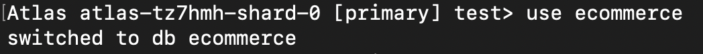

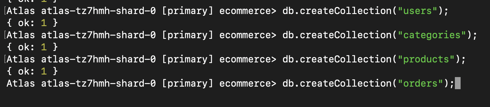

### 5.2 Inserting Users

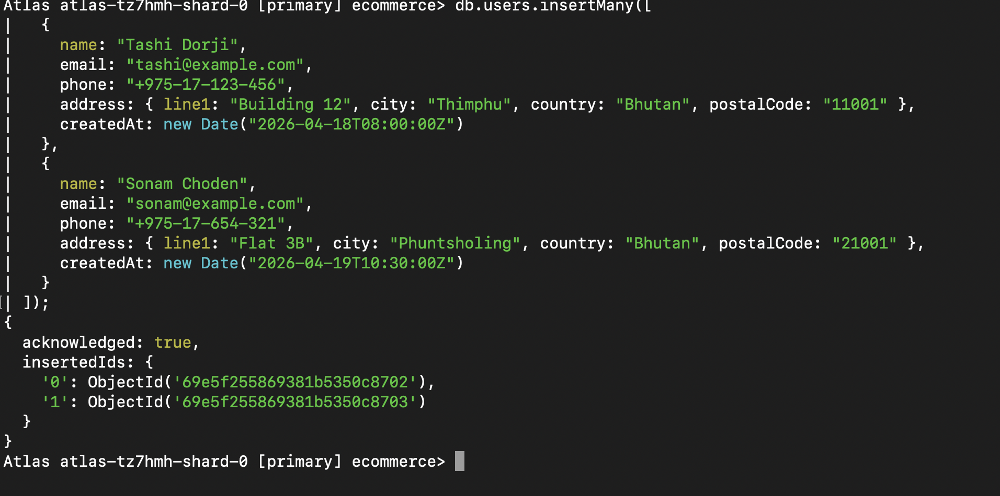

### 5.3 Inserting Categories


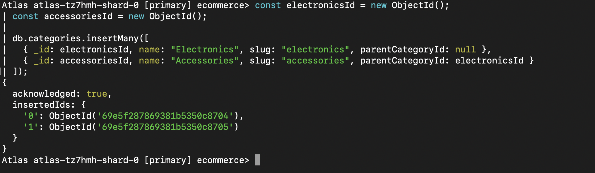

### 5.4 Inserting Products

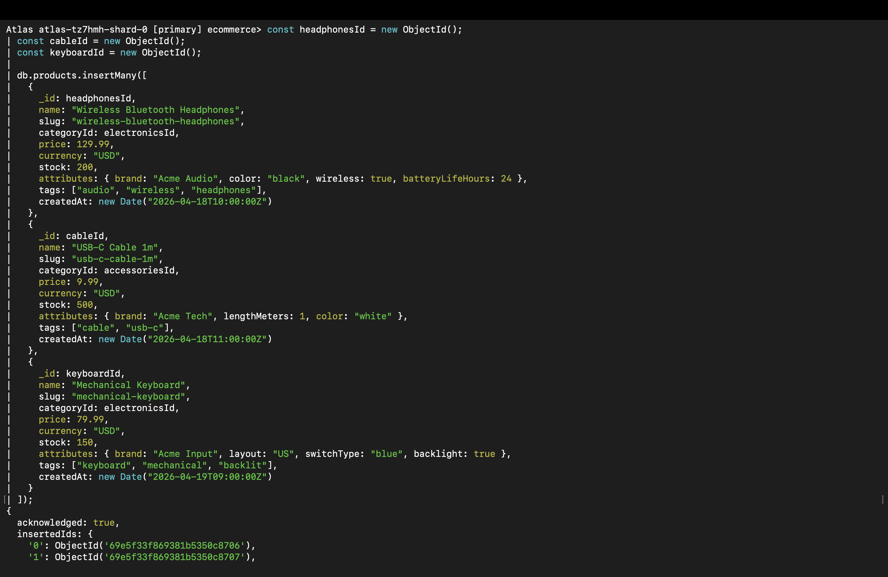

### 5.5 Inserting Orders

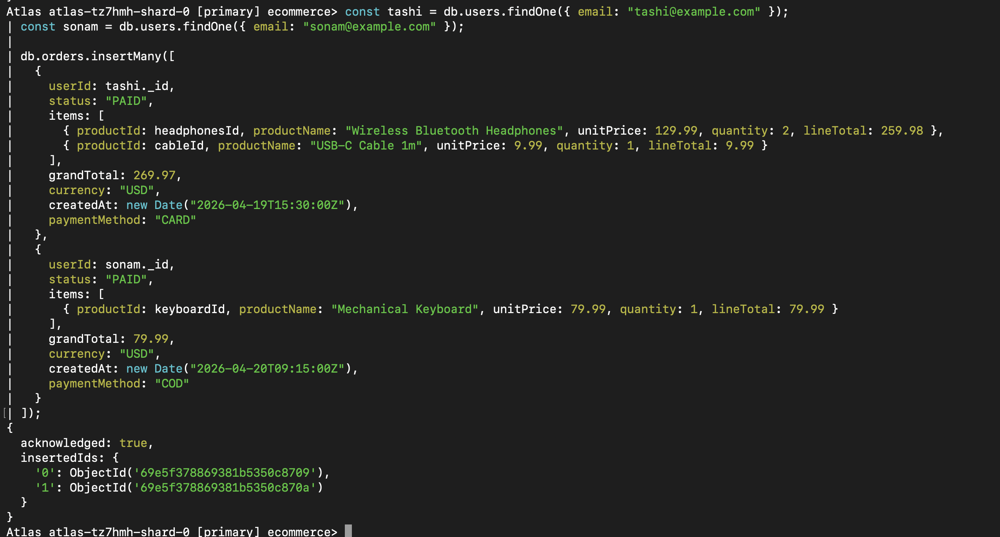

## 6. Aggregation Framework Queries

### 6.1 Query 1: Daily Sales Totals

**Goal:** Compute total revenue and number of orders per day for completed (PAID) orders.

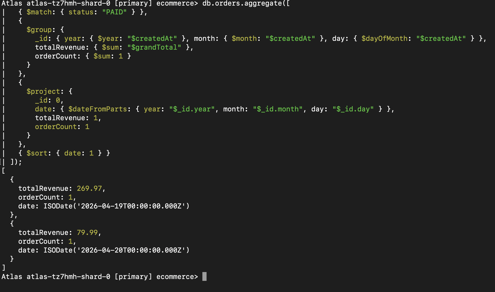

### 6.2 Query 2: Top Products by Revenue

**Goal:** Find the top 5 products by total revenue across all orders.

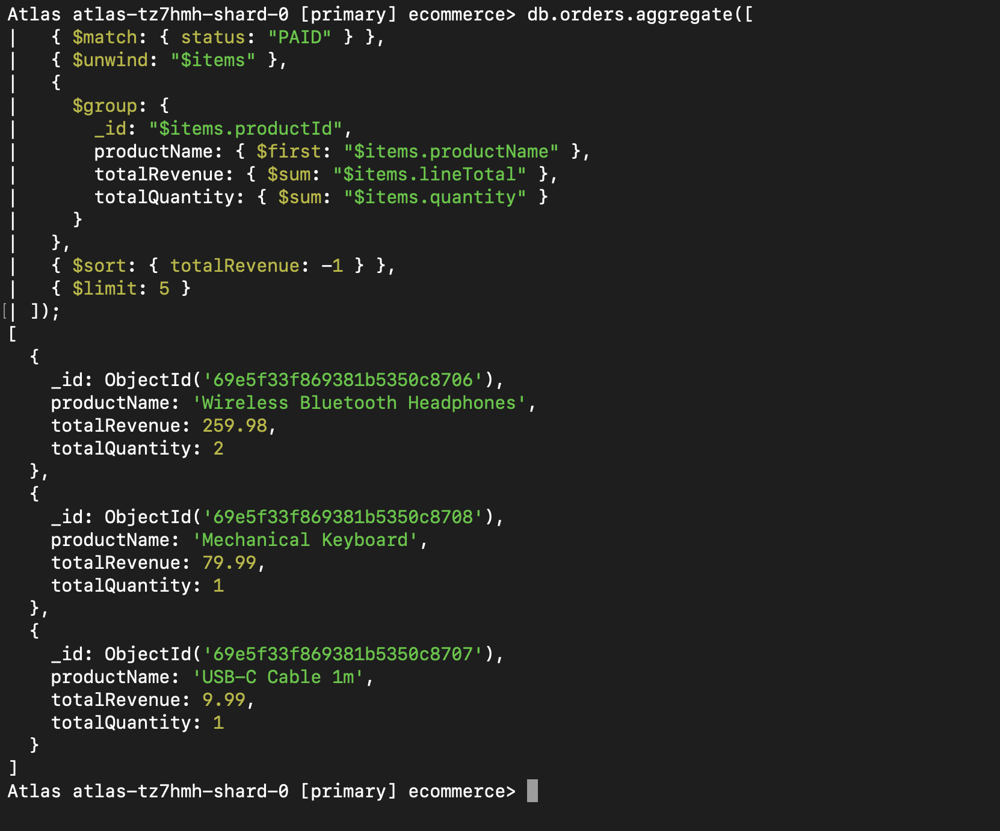

### 6.3 Query 3: Average Order Value per User

**Goal:** Compute spending statistics for each customer and enrich with their name using `$lookup`.

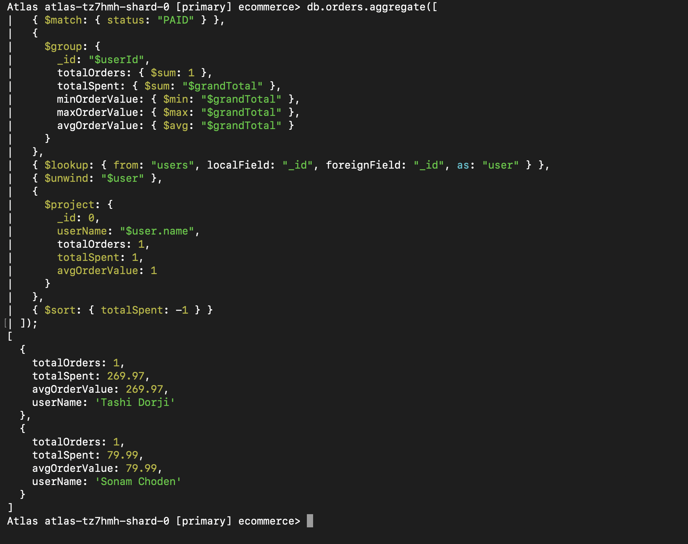

### 6.4 Query 4: Product Catalog with Category Name

**Goal:** List products with their category name using `$lookup`.

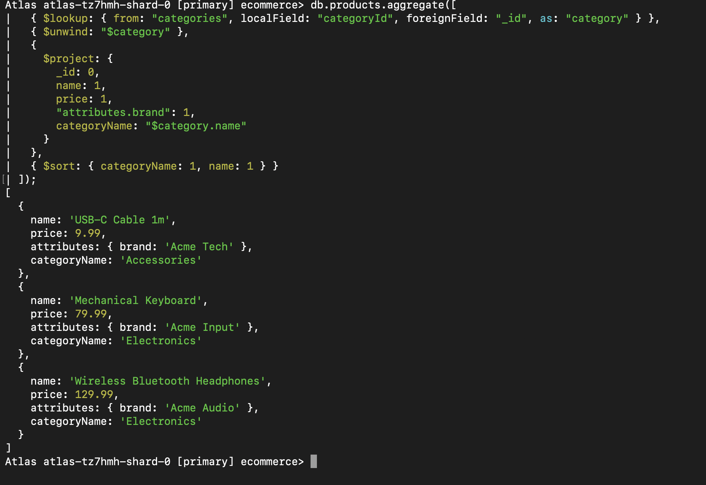

## 7. Indexing and Query Optimization

### 7.1 Indexes Created

| Index Name | Fields | Type | Use Case |
|------------|--------|------|----------|
| `idx_orders_user_createdAt` | `userId: 1, createdAt: -1` | Compound | Fetch recent orders for a user |
| `idx_orders_status_createdAt_grandTotal` | `status: 1, createdAt: -1, grandTotal: 1` | Compound (ESR) | Filter orders by status and date range |
| `idx_products_category_price` | `categoryId: 1, price: 1` | Compound | List products by category sorted by price |
| `idx_products_text` | `name: text, tags: text` | Text | Full-text product search with relevance scoring |

### 7.2 ESR Rule Explanation

The **ESR (Equality → Sort → Range)** rule guides the ordering of fields in a compound index:

- **Equality fields first:** Fields tested with exact match (e.g., `status: "PAID"`)
- **Sort fields second:** Fields used in `.sort()` (e.g., `createdAt: -1`)
- **Range fields last:** Fields tested with range operators like `$gte`, `$lte`

Following ESR ensures MongoDB can use the index efficiently for filtering, sorting, and range scans in a single pass.

### 7.3 Index Creation Commands

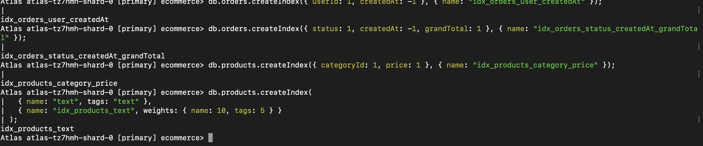

### 7.4 Text Search Example

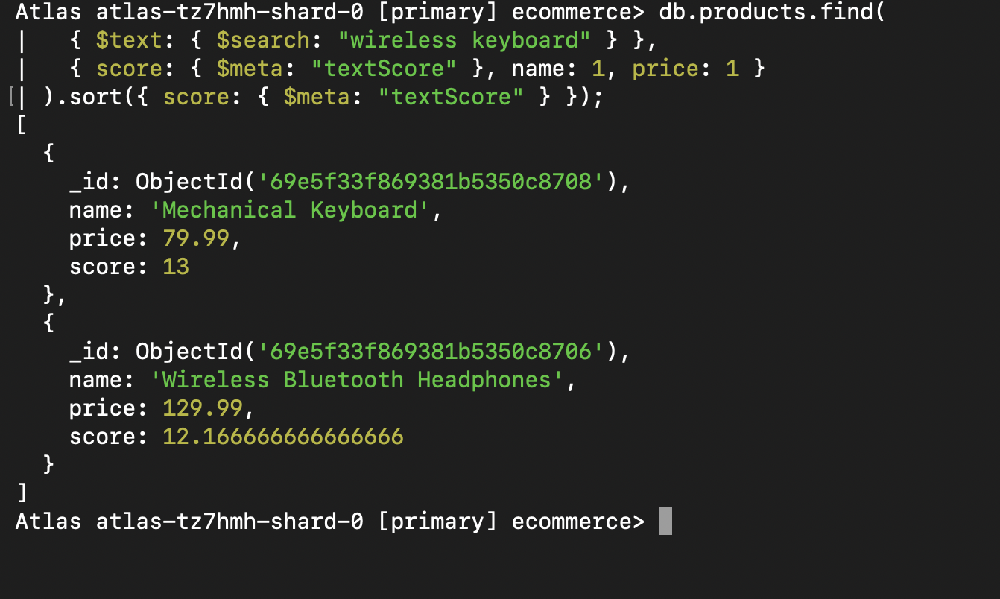

The text index with weights (`name: 10`, `tags: 5`) ensures products matching in the `name` field rank higher than those matching only in `tags`.


## 8. Query Performance Analysis with explain()

### 8.1 Methodology

`explain("executionStats")` was used to inspect query plans before and after index creation. Key metrics observed:

- **`stage`:** `COLLSCAN` (no index) vs `IXSCAN` (uses index)
- **`totalDocsExamined`:** Number of documents MongoDB had to inspect
- **`totalKeysExamined`:** Number of index entries scanned
- **`executionTimeMillis`:** Query execution time in milliseconds

### 8.2 Test Query

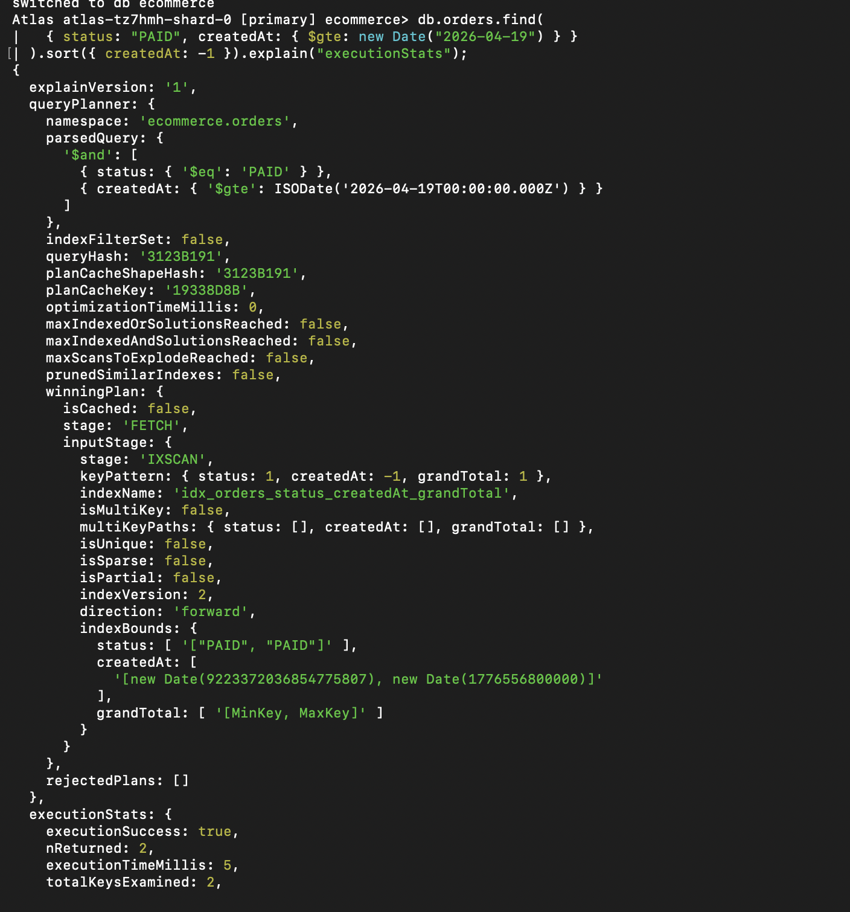

### 8.3 Results: Before vs After Index

| Metric | Before Index (COLLSCAN) | After Index (IXSCAN) |
|--------|------------------------|----------------------|
| Winning Plan Stage | `COLLSCAN` | `IXSCAN` |
| `totalDocsExamined` | All documents in collection | Only matching documents |
| `totalKeysExamined` | 0 (no index used) | Matches number of results |
| `executionTimeMillis` | Higher (scales with collection size) | Lower (index-driven) |

### 8.4 Analysis

Before the index was created, MongoDB performed a `COLLSCAN`, meaning every document in the orders collection was read to find matching results. This is highly inefficient at scale.

After creating the compound index `{ status: 1, createdAt: -1 }`, MongoDB switched to an `IXSCAN`. The query could directly navigate to relevant index entries, dramatically reducing the number of documents examined and improving response time.

This confirms that compound indexes following the ESR pattern provide significant performance benefits for filter-and-sort queries.


## 9. Common Mistakes and How to Avoid Them

| Mistake | Impact | Correct Approach |
|---------|--------|-----------------|
| Schema designed like a relational DB (too many `$lookup` joins) | Slow reads, complex pipelines | Embed tightly coupled data (e.g., order items in orders) |
| Unbounded document growth (infinite array push) | Document exceeds 16MB BSON limit | Use separate documents or collections for unbounded arrays |
| Missing indexes on frequently queried fields | `COLLSCAN` on large collections | Create indexes for all high-frequency filter/sort fields |
| Wrong compound index field order | Partial or no index usage | Follow ESR (Equality → Sort → Range) ordering |
| Over-indexing (too many indexes) | Heavy write overhead, large storage | Only index fields used in critical queries; drop unused indexes |
| Not verifying index usage with `explain()` | False assumption that queries are fast | Always run `explain("executionStats")` after creating indexes |


## 10. Conclusion

This practical successfully demonstrated the full workflow of designing, implementing, and optimizing a MongoDB-based e-commerce platform schema.

Key takeaways:

- **Query-driven design:** Structuring collections around access patterns (not normalization) leads to more efficient reads.
- **Embedding vs referencing:** Embedding order items inside orders reduces the need for expensive joins. Referencing is used for shared entities like products and users.
- **Aggregation pipelines:** MongoDB's aggregation framework provides powerful tools for analytics — from simple daily totals to multi-collection joins with `$lookup`.
- **Indexing:** Compound indexes following the ESR rule significantly improve query performance. Text indexes enable full-text search with relevance scoring.
- **`explain()`:** A critical tool for verifying whether queries are using indexes and measuring performance improvements.

MongoDB's flexible document model proved well-suited for the heterogeneous nature of an e-commerce product catalog, where different product types have different attributes. The Attribute Pattern elegantly handles this variability without requiring schema migrations.


## 11. References

- MongoDB Documentation – Data Modeling: https://www.mongodb.com/docs/manual/data-modeling/
- MongoDB Documentation – Aggregation Pipeline: https://www.mongodb.com/docs/manual/aggregation/
- MongoDB Documentation – Indexes: https://www.mongodb.com/docs/manual/indexes/
- MongoDB Documentation – explain(): https://www.mongodb.com/docs/manual/reference/method/cursor.explain/
- DBS302 Practical 3 Guide – HackMD (sarojsanyasi)


